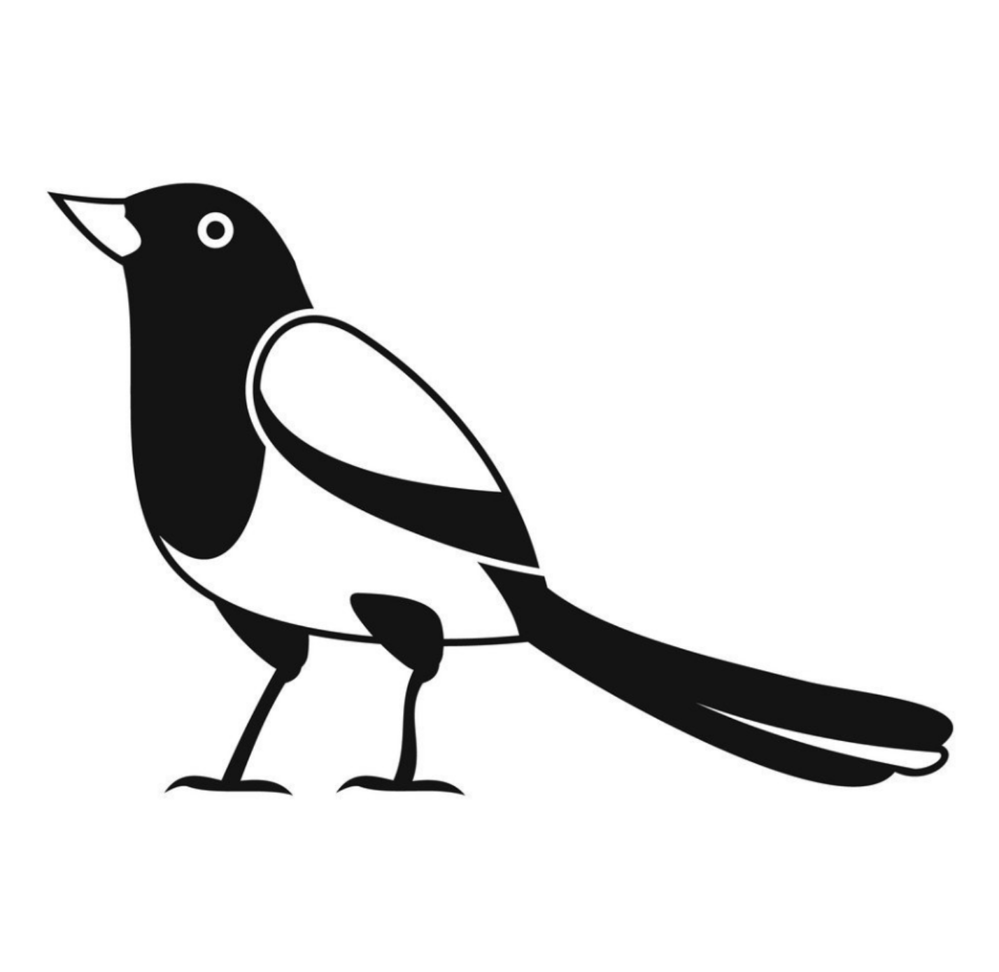

## Story
<div style="text-align:center;">

</div>

- Story - легковесный фреймворк на базе *express.js* для быстрого создания приложений на *Node.js*
- Работает с протоколами http, websocket, с брокером сообщений rabbitMQ и с клиентом БД - PostgreSQL
- Использует доменно-событийную модель

### Оглавление
- [Файловая структура проекта](#Файловая-структура-проекта)
    - [Вспомогательные файлы](#Вспомогательные-файлы)
    - [Конфигурационный файл](#Конфигурационный-файл)
    - [Корневой файл проекта](#Корневой-файл-проекта)
    - [Для работы с сущностью](#Для-работы-с-сущностью)
        - [controller](#controller)
        - [service](#service)
        - [queries](#queries)
        - [schema](#schema)
- [Пример запроса](#Пример-запроса)
- [Пример ответа](#Пример-ответа)
- [Коммуникационные протоколы](#Коммуникационные-протоколы)
    - [http](#http)
    - [websockets](#websockets)
    - [rmq](#rmq)
- [Работа с БД](#Работа-с-бд)
- [Работа с токеном](#Работа-с-токеном)
- [Ошибки](#Ошибки)
- [Основные модули Story](#Основные-модули-Story)
    - [gate](#gate)
    - [http-adapter](http-adapter)
    - [ws-adapter](ws-adapter)
    - [rmq-adapter](#rmq-adapter)
    - [db-adapter](db-adapter)
    - [validator](validator)
    - [logger](logger)

### Файловая структура проекта
Вот файловая структура базового проекта на примере приложения cats-application, а далее рассмотрим каждый элемент
подробнее

```
cats-application
|
|__src (Основная рабочая директория)
|   |__db (Директория для работы модуля db-migrate)
|   |   |__migrations (Список миграций)
|   |   |      |__sqls
|   |   |           |__up-migration.sql (SQL-запрос для накатывания миграции)
|   |   |           |__down-migrations.sql (SQL-запрос для отката миграции)
|   |   |__index.js (Исполняемый скрипт миграции)
|   |   |
|   |   |__database.json (Настройки, для подключения db-migrate к базе данных)
|   |
|   |__entities (Сущности приложения)
|        |__cats (Методы сущности cats)
|            |
|            |__cats-controller.js (Валидирует и предобрабатывает запросы. См ниже пример)
|            |__cats-service.js (Основная логика. См ниже пример)
|            |__queries.js (SQL-запросы. См ниже пример)
|            |__schemas.js (Схемы валидации. См ниже пример)
|
|__.eslintrc
|__.gitignore
|__app.js (Корневой файл приложения. См пример ниже)
|__config.js (Конфигурационный файл приложения. См пример ниже)
|__package.json
```

Базовый проект можно забрать [здесь](https://github.com/muratbyazrov/story-cats)

##### Вспомогательные файлы

- .eslintrc
- .gitignore
- package.json

##### Конфигурационный файл
Пожалуйста, не впадайте в панику при виде конфигурационного файла. Все параметры подробно описаны в соответствующих разделах.
К тому же, много параметров заданы по умолчанию

```JS
// config.js
module.exports = {
    db: {
        user: 'user-name',
        host: '127.10.10.11',
        database: 'se',
        schema: 'database-schema',
        password: 'test',
        port: 5432,
    },
    http: {
        host: '192.168.236.109',
        port: 3001,
        path: '/path/v1',
    },
    ws: {
        host: '192.168.236.109',
        port: 9001,
    },
    rmq: {
        connect: {
            host: '127.10.10.11',
            port: 5672,
            queueName: 'cats',
            user: 'test',
            password: 'test',
        },
        consume: {
            exchange: 'cats',
            exchangeType: 'direct',
            exchangeDurable: false,
            queue: 'cats',
            queueDurable: false,
            noAck: true,
            prefetchCount: 1,
            xMessageTtl: 10 * 60 * 1000,
            selfAck: true,
        },
        publish: {
          persistent: true,
          domains: {
            dogs: {
              exchange: 'story',
              routingKey: 'account',
            }  
          }
        },
    },
    token: {
        enabled: true,
        expiresIn: 100000,
        uncheckMethods: {
            domain_1: ["event_1", "event_2"],
            domain_2: ["event_1", "event_2"],
        }
    },
};
```

##### Корневой файл проекта

```JS
// app.js
const {Story} = require('story-system');
const config = require('./config.js');
const {CatsController} = require('./src/entities/cats/cats-controller.js');

class App {
    constructor() {
        Story.gateInit(config, [
            {EntityController: CatsController, domain: 'cats'},
        ]);
        Story.adaptersInit(config);
    }
}

new App();
```

### Для работы с сущностью

##### controller
Валидирует и предобрабатывает запросы. В общем, вся логика, не относящаяся к бизнес-логике. <br>
Каждый контроллер принимает два параметра:

- data - *object* - тело запроса
- tokenData - *object* - данные, которые были переданы при генерации токена. (смотрите подробнее раздел "Работа с токеном")
Таким образом, можно извлечь эти данные и использовать их в запросе.

```JS
// cats-controller.js
const {Story} = require('story-system');
const {getCatsSchema} = require('./schemas.js');
const {CatsService} = require('./cats-service');

class CatsController {
    constructor() {
        this.accountsService = new CatsService();
    }

    getCats(data, tokenData) {
        Story.validator.validate(data, getCatsSchema);
        const {catId} = tokenData;
        console.log('${catId} - это id кота, который был передан в функцию `genetateToken` при генерации токена');
        return this.accountsService.getCats(data);
    }
}

module.exports = {CatsController};
```

##### service
Основная бизнес-логика метода

```JS
// cats-service.js
const {Story} = require('story-system');
const {getCats} = require('./queries.js');

class CatsService {
    getCats(data) {
        return Story.dbAdapter.execQuery({
            queryName: getCats,
            params: data.params,
        });
    }
}

module.exports = {CatsService};
```

##### queries
SQL-запросы, необходимые для метода

```JS
// queries.js
module.exports = {
    getCats: `
        SELECT
             cat_id AS "catId"
            ,cat_name AS "catName"
        FROM
            cats AS c
        WHERE
            TRUE
            /*catId: AND cat_id = :catId*/
        /*offset: OFFSET :offset*/
        LIMIT :limit;`,
};
```

##### schema
Схема валидации

```JS
// schema.js
const {Story: {validator: {schemaItems: {string, number, limit}}}} = require('story-system');

const getCatsSchema = {
    id: 'getCatsSchema',
    type: 'object',
    additionalItems: true,
    properties: {
        params: {
            type: 'object',
            properties: {
                limit,
                accountId: string,
                login: string,
                password: string,
            },
            required: ['limit', 'login', 'password'],
        },
    },
    required: ['params'],
};

module.exports = {
    getCatsSchema,
};
```

### Пример запроса
Вне зависимости от протокола (http, ws или rmq) запрос должен имеет один и тот же вид:

```JSON
{
  "domain": "cats",
  "event": "getCats",
  "params": {
    "limit": 5
  },
  "token": ""
}
```

*Примечание* <br>
По http всегда принимается POST-запрос. Не используйте GET, UPDATE и так далее

### Пример ответа

Успешный ответ

```JSON
{
  "domain": "cats",
  "event": "getCats",
  "data": [
    {
      "catId": 1,
      "catName": "Scot"
    }
  ]
}
```

Ответ с ошибкой

```JSON
{
  "domain": "cats",
  "event": "getCats",
  "error": [
    {
      "code": 403,
      "name": "Forbidden",
      "message": "error message"
    }
  ]
}
```

### Коммуникационные протоколы
Из коробки поддерживаются три протокола: http, ws, rmq.  
Чтобы включить/отключить протокол, достаточно в файле конфига указывать/не указывать соответствующую настройку.   
То есть если в файле конфига не будет настроек по `ws` - сервис не будет принимать сообщения по `ws`.  
Важно указать, что независимо от протокола, сообщение и ответ имеют один и тот же [вид](#Пример-запроса), что, по-моему, 
мнению очень удобно.

#### http

#### websockets
Полезно, когда сервису нужно принимать сообщения в реалтайме. Можно слушать сообщения по ws и отправлять их. Вот пример
отправки сообщения по `ws`:

```JS
async createMessage(data) {
    const message = 'Привет кот!';
    const sessionId = 'some guid';

    await Story.wsAdapter.send(message, {
        sessionId,
        domain: 'cats',
        event: 'catCreated',
    });
    
    return message;
}
```

Как мы видим, метод `Story.wsAdapter.send()` принимает два параметра:

- `message` - тело сообщения
- `options` - параметры сообщения
    - `sessionId` - идентификатор ws-сессии. Дело в том, что когда к вашему сервису подрубается клиент по ws, для него
      создается ws-сессия и присваивается `sessionId`. Этот `sessionId` отправляется клиенту сразу после подключения.
      Это нужно, чтобы различать ws-клиентов. Когда клиент отключается - он теряет сессию и при переподключении для него
      создается новая сессия. Об этом подробнее написано в разделе про работу модулей.
    - `domain` - домен сообщения, чтобы клиент знал, с какого домена пришло сообщение
    - `event` - событие сообщения, чтобы клиент знал, какое событие породило это сообщение

#### rmq
Сервис поддерживают работу с RabbitMQ. Поддержка других брокеров сообщений появится в след версиях при необходимости.  
С использованием rabbitMQ появляется возможность легкого распараллеливания работы между несколькими инстансами одного
сервиса. Так же можно упростить взаимодействие между сервисами.  

Все поля из конфигурации более подробно описаны [здесь](#Rmq-Adapter)

```js
{
    rmq: {
        connect: { // Настройки подключения
            host: '127.10.10.11',           // По умолчанию localhost
            port: 5672,                     // По умолчанию 5672
            queueName: 'cats',              // По умолчанию 5672
            user: 'test',                   // По умолчанию story
            password: 'test',               // По умолчанию story
        },
        consume: {                          // Настройки прослушки сообщений
            exchange: 'cats',               // Название обменника. По умолчанию 'story'
            exchangeType: 'direct',         // Тип обменника. По умолчанию 'fanout'
            exchangeDurable: false,         // Сохранять ли состояние обмменика после отключение сервера rabbit. По умолчанию false
            bindPattern: 'cats_pattern',     // Паттерн (строка), по которому надо привязывать обменники с очередями
            queue: 'cats',                  // Имя очереди, которую будем слушать. Если не указать, название будет сгенерировано
            queueDurable: false,            // Сохранять ли состояние очереди после отключение сервера rabbit. По умолчанию false 
            noAck: true,                    // Автоматическое подтверждение (или нет) сообщений
            prefetchCount: 1,               // Максимальное количество сообщений, принимаемых потребителем за раз
            xMessageTtl: 10 * 60 * 1000,    // время жизни сообщений в миллисекундах
            selfAck: true,                  // Подписывать и подтвреждать собственные сообщения
        },
        publish: {                          // Настройки отправки сообщений
            persistent: true,               // Сохранять сообщения на диске сервера rabbit или нет
            exchanges: {                    // Обменники, в которые публишим сообщения 
                dogs: { 
                    exchange: 'story',      // Название обменника
                    routingKey: 'account',  // Ключ маршрутизации. Работает в паре с bindPattern
                }
            }
        },
    },
}
```
Пример публикации сообщения в rmq
```js
const {rmq: {publish: {exchanges}}, token} = require('../../../config');

async function publishCatInRmq() {
    await Story.rmqAdapter.publish({
        message: {
            domain: 'messages',
            event: 'test',
            params: {},
            token: await Story.token.generateToken({}, token),
        },
        options: exchanges.dogs,
    });
}
```

### Ошибки
Ошибка базы данных
```json
{
  "code": 900,
  "name": "Data Base Error",
  "message": "error message"
}
```

Ошибка rmq
```json
{
  "code": 600,
  "name": "RMQ error",
  "message": "error message"
}
```

Ошибка валидации
```json
{
  "code": 400,
  "name": "Validation error",
  "message": "error message"
}
```

Ошибка токена
```json
{
  "code": 800,
  "name": "Token error",
  "message": "error message"
}
```

Ошибка доступа
```json
{
  "code": 403,
  "name": "Forbidden",
  "message": "error message"
}
```

Ошибка NotFound
```json
{
  "code": 404,
  "name": "Not Found",
  "message": "error message"
}
```

## Работа с БД

- Сейчас Story поддерживает только Postgres

```shell
# Создать миграцию миграции
db-migrate create <название миграции> --config ./database.json -e pg -m ./migrations --sql-file
```

```shell
# Накатить миграцию
db-migrate up --config ./database.development.json -e pg -m ./migrations
```

## Работа с токеном
Рассмотрим ещё раз конфигурационный файл и в нем настройку работы с токеном:

```js
{
    token: {
        enabled: true,
        key: 'token-key',
        expiresIn: 60 * 1000,
        uncheckMethods: {
            cats: ['signIn', 'creteCat'],
        },
    },
}
```

Давайте разберем подробнее каждую настройку:

- `enabled`- *boolean* - если true, то у всех запросов будет проверяться токен
- `expiresIn`- *number* - время жизни токена в миллисекундах. По умолчанию 24 часа Рефреш токена будет реализован в
  след. версиях
- `uncheckMethods`- *object* - Объект ключами которого являются домены (`domain`), а значениям - массив методов (`event`). Для
  этих методов токен не будет проверяться, даже если будет включен флаг enabled. Обратная логика будет реализована в
  след. версиях

Пример авторизации, с генерацией и возвращением токена

```js
const config = require('../../../config');

signIn(data) {
    Story.validator.validate(data, signInSchema);
    const [cat] = await this.accountsService.getCats(data);
    if (!cat) {
        throw new Story.errors.Forbidden('Нет такого кота!');
    }
    
    return {token: await Story.token.generateToken(account, config.token)};
}
```

Запрос

```json
{
  "domain": "cats",
  "event": "signIn",
  "params": {
    "login": "Jane",
    "password": "Jane"
  }
}
```

Ответ

```json
{
  "domain": "cats",
  "event": "signIn",
  "data": {
    "token": "very-long-token"
  }
}
```

## Основные модули Story
Данный раздел будет полезен для разработчиков, которые хотят понять, как работают модули Story и предложить какие-то улучшения.  
Я всегда буду рад помощи в развитии этого фреймворка, т.к. конечно же он не может быть идеальным с первого релиза.   
Story - это что-то среднее между минималистическим express.js и довольно сложным Nest.js, но со своими особенностями, 
такими как работа с БД и доменно-событийная модель. Присылайте свои идеи по улучшения и mergeRequests!

[//]: # (
Сначала запускаются адаптеры, потом запускается гейт
)

### gate
Все запросы (http, ws, rmq) идут через gate.

- Конструирует объект `controllers`, состоящий из пар {`<domain>`: `<controller>`}
  (Домен и контроллер регистрируются в корневом файле проекта `app.js`)
- Выполняет первичную валидацию запроса (на наличие в запросе параметров `domain` и`event`)
    - Приводит запрос к объекту *JavaScript*
    - Проверяет выданный токен. Если токен не валидный, возвращает ответ с ошибкой
    - Проверяет, существует ли `domain`. Если `domain` не существует, возвращает ответ с ошибкой.
    - Проверяет, существует ли метод (`event`). Если метод не существует, возвращает ответ с ошибкой.
- Выполняет запрос, обращаясь к нужному контроллеру, а затем к нужному методу контроллера
  (`controllers[data.domain][data.event](data)`, где `data` - это тело запроса
- Приводит ответ к системному ответу
- Возвращает ответ

*Примечание*. Если вы задаетесь вопросом, как запросы попадают в `gate`, то обратите внимание на [корневой](index.js)
файл фреймворка. Здесь видно, что после инициализации в адаптеры передаются колбэком метод
`gate.run(request)`, который после инициализации проекта содержит всю логику контроллеров в себе.

### Rmq Adapter
Используется библиотека amqplib. Модуль содержит три основных метода: `run`, `consume`, `publish`

#### run
Инициализирующий метод
- Подключается к серверу rabbitMQ
- Вызывает приватный метод `cunsume`
- Использует настройки конфига:
  - `host` - хост сервера rabbitMQ
  - `port` - порт сервера rabbitMQ
  - `user` - логин сервера rabbitMQ
  - `password` - пароль сервера rabbitMQ

#### consume
Метод, запускает процесс прослушивания и обработки сообщений
- Создает канал `connection.createChannel()`
  - В рамках канала настраивает обменник `channel.assertExchange(exchange, type, options)`
  - Настраивает очередь `chanel.assertQueue(queue, options)`
    - Настраивает привязку `chanel.bindQueue(queue, source, pattern, argt)`. Нужно для маршрутизации сообщений. Подробнее [тут](https://www.rabbitmq.com/tutorials/tutorial-four-javascript.html)
  - Запускает прослушку сообщений: `channel.consume()`
- Использует настройки конфига:
  - `exchange` - название очереди
  - `exchangeType` - тип маршрутизатора. Подробнее про типы [тут](https://habr.com/ru/company/southbridge/blog/703060/) и [тут](https://www.rabbitmq.com/tutorials/tutorial-three-javascript.html)
    - `fanout` - отправляет сообщения во все известные каналы
    - `direct` - отправляет сообщения только в те каналы, где `routingKey` полностью совпадает с `bindPattern`
    - `topic`
    - `headers` 
  - `exchangeDurable` - *boolean*
    - `true` - обменник будет сохранять свое состояние и восстанавливается после перезапуска сервера брокера
    - `false` - после перезапуска брокера обменник удалится
  - `bindPattern` - паттерн, по которому надо привязывать обменники с очередями. Необходимо, если типа обменника `direct` или `topic`
  - `queue` - *string* - Название очереди, которую создаем и будем слушать. Если `queue = ""` rabbit создаст временную очередь со сгенерированным названием и удалит после отключение потребителя 
  - `queueDurable` - *boolean*
    - `true` - очередь будет сохранять свое состояние и восстанавливается после перезапуска сервера брокера
    - `false` - после перезапуска брокера очередь удалится
  - `exchangeDurable` - *boolean* - если true, то exchange будет сохранять свое состояние и восстанавливается после перезапуска сервера/брокера
  - `noAck`- *boolean* - автоматическое подтверждение (или нет) сообщений. В любом случае rabbit подтвердит сообщение, если оно висит больше 30 минут. (Этот таймаут можно [настраивать](https://www.rabbitmq.com/consumers.html#acknowledgement-timeout)))
    - `false` - сообщения не будут подтверждаться автоматически. Тогда при ошибке другой инстанс может взять сообщение в работу. Но сервис должен сам подтверждать сообщения `channel.ack(msg)`. 
    - `true` - сообщение автоматически подтвердиться сразу после прочтения и удалится из очереди
  - `prefetchCount` - *number* - Максимальное количество сообщений, принимаемых потребителем за раз. Установив `1` rabbit не отправит новое сообщение сервису, пока тот не подтвердит старое 
  - `bindQueuePattern` - *string* - По какому паттерну будут связываться `exchange` и `queue`
  - `xMessageTtl` - *number* - время жизни сообщений в миллисекундах. После этого сообщения удаляются из очереди, даже если не были акнуты
  - `selfAck` - *boolean* - полезно, когда вы хотите просто запублишить сообщение во все очереди, но хотите, чтобы сервис не считал свое собственное сообщение. Используется при `exchangeType = fanout`
    - `true` - сервис будет автоматически подтверждать свои сообщения без обработки. Это работает благодаря подписи отправляемых сообщений строкой конифга consume. Подробнее смотрите код
    - `false` - сервис не будет подтверждать свои сообщения и тогда возможно возникновение цикличности. 

#### publish
Публичный метод для публикации сообщений и настраивается параметры конфига
- Использует настройки конфига:
  - `persistent` - *boolean*
    - `true` - сообщения не потеряются даже при аварии на сервере rabbitMQ. Это работает в паре с `durable: true`
    - `false` - сообщения удаляются после перезапуска сервера брокера. Это полезно, когда скорость важнее, чем надежность
- Использует опции сообщения:
  - `exchange` - название обменника, в который мы хотим опубликовать сообщение
  - `routingKey` - ключ маршрутизации. Указывает, в какие очереди должны попасть сообщения. Используется exchangeType `direct` и `topic`
